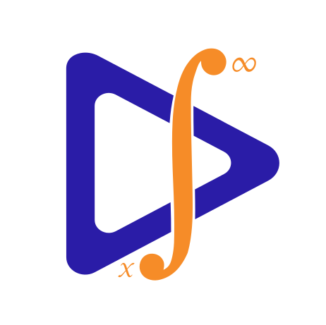
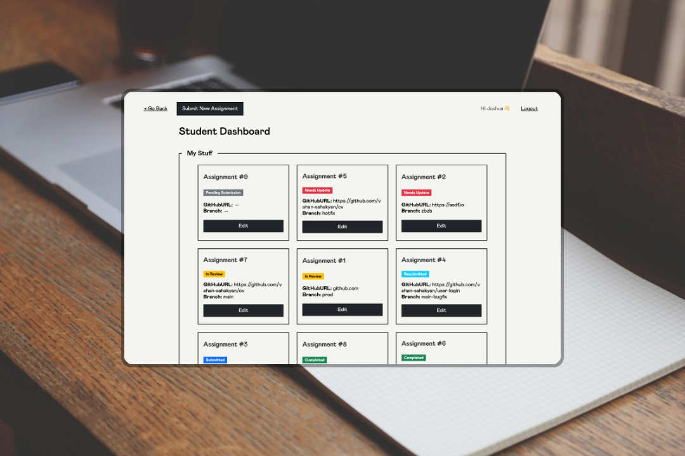
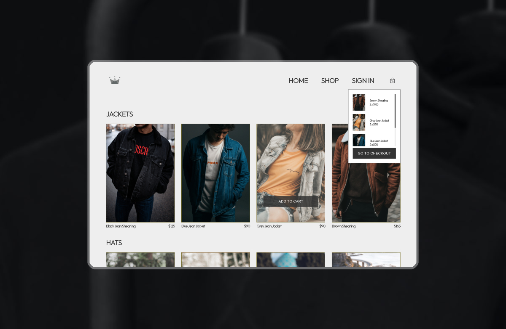

# Vahan Sahakyan | Software Engineer

With a passion for React.js, TypeScript, Node.js, Java, Bash scripting, exploring the world of microservices, API design, RDBMS, and system architecture. Specialized in Frontend/Backend Development.

  
<b>EXPERIENCE 💻</b> <i class="icon-plus"></i>

  
   
  
  ### 🔵 Frontend Software Engineer at Datafoundry
  <!--  -->
  #### Datafoundry · Full-time  
  Oct 2023 - Present · Yerevan, Armenia · Hybrid
   
  
  - Organizing large-scale refactoring between MicroFrontends.
  - Setting up frontend quality tools like ESLint in legacy codebases.
  - Writing unit tests for achieving an overall minimum of 70% code coverage.
  - Reducing code smells down to zero for passing SonarQube quality gate.
  - Implementing an InputControlEngine for rendering server-side generated forms.
  
  **Skills:** React.js · ESLint · TypeScript · JSDoc · Webpack · Productivity Improvement
  
  

  
  ### 🔵 Frontend Software Engineer at NWSLAB
  <!--  -->
  #### NWSLAB · Full-time  
  Nov 2022 - Jul 2023 · Yerevan, Armenia · Hybrid
   
  
  - Providing top-notch Web Services in a team full of detail-oriented professionals, with deep expertise specifically in front-end technology best practices and a routine of strict code reviews for each pull request.
  - Taking a journey with NWSLAB feels like a pilgrimage of becoming a TypeScript "Wizard".
  
  **Skills:** React.js · JavaScript · Redux.js · ESLint · TypeScript · Material-UI · Business Analysis · Regular
  
  

  
  ### 🔵 Frontend Software Engineer at Datafoundry
  <!--  -->
  #### Datafoundry · Full-time  
  Mar 2022 - Nov 2022 · Yerevan, Armenia · Hybrid
   
  
  - Developed a complex UI from scratch, based on new requirement specifications.
  - Integrated and reused the legacy code functionality.
  - Optimized the performance by modifying the state flow (Thunks -> Sagas).
  - Refactored the codebase following the SOC concept.
  - Designed tech solutions by collaborating with the backend engineers.
  
  **DF mSignal AI - SaaS Application.**

**Tools:** React, Axios, Redux-Saga, Lodash

**Visuals:** Ant Design, SCSS, Bootstrap, Styled-Components, Chart.js

**Other:** Postman, RESTful API Integration [CRUD]

**Skills:** React.js · JavaScript · Redux.js · Saga · Ant Design
 
 
 
 
 

  
<b>EDUCATION 📚</b> <i class="icon-plus"></i>

  
   
  
  #### 🟢 Bootcamp - "BPC Armenia" [C++, Python, Linux, Bash]
  **Artak Yenokyan - Engineering Manager at Siemens EDA**
  2018-2019
  
  

  
  #### 🟢 Course - The Complete JS Course
  **UDEMY: Jonas Schmedtmann**
  2021-2022
  
  

  
  #### 🟢 Course - Node/Express Bootcamp
  **UDEMY: Jonas Schmedtmann**
  2021-2022
  
  

  
  #### 🟢 Course - React/Redux Course
  **ZTM: Andrei Neagoie**
  2021-2022
  
  

  
  #### 🟢 Course - Java Core 11 Course
  **John Purcell: Derby, UK**
  2022-2023
  
 
 
 
 
 

  
<b>SELECTED WORKS 🗂️</b> <i class="icon-plus"></i>

    

        <h3>Code Inspect</h3>
        
        
<a href="https://github.com/vahan-sahakyan/ci-composed">Code Inspect GitHub Repository</a>

        
Description: Code Inspect project utilizing React and Spring-Boot.

    

    <!--  -->
    

        <h3>CRWN CLOTHING</h3>
        
        
<a href="https://github.com/vahan-sahakyan/crwn-clothing">CRWN CLOTHING GitHub Repository</a>

        
Description: CRWN CLOTHING project built with React and Firebase.

    

    <!--  -->
    

        <h3>Piano Emulator</h3>
        
        
<a href="https://github.com/vahan-sahakyan/e-piano">Piano Emulator GitHub Repository</a>

        
Description: Piano Emulator project developed using JavaScript and Audio API.

    

 
 
 
 
 

## Let’s Work Together

I am open to talk about new opportunities. Just say hi and we’ll start a productive cooperation.

Call me: [+374 95 27 68 27](tel:+37495276827)  
Say hi: [vahan.sahakyan1996@gmail.com](mailto:vahan.sahakyan1996@gmail.com)

